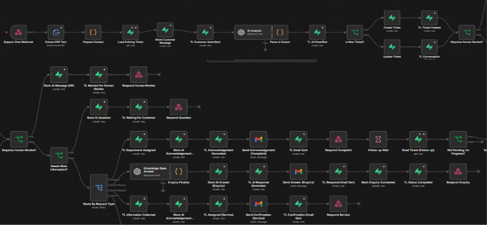
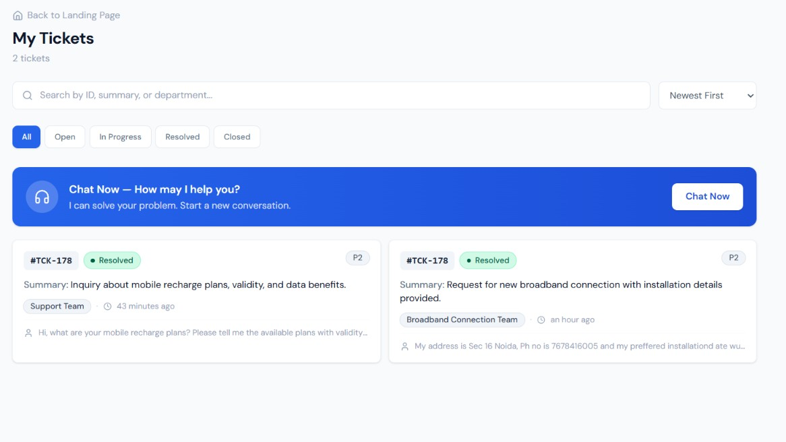
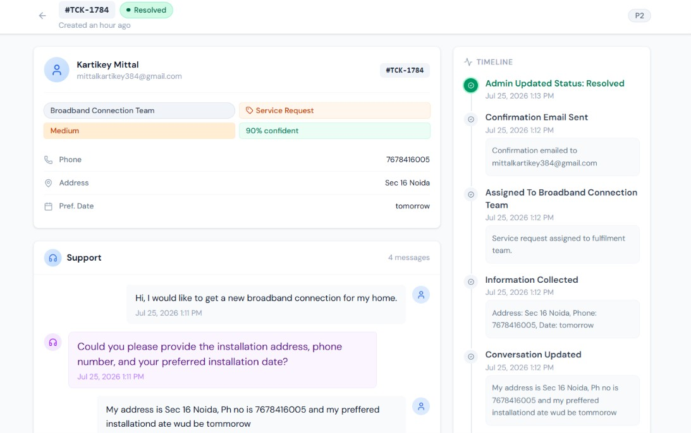
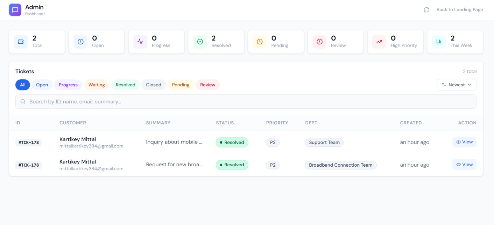

# AI Telecom Customer Support System

An AI-powered telecom customer support platform that automates customer request classification, workflow execution, ticket management, and customer communication using OpenAI, n8n, React, and Supabase.

**Live Demo:** [https://telecom-support.vercel.app/](https://telecom-support.vercel.app/)

---

## System Architecture

### Sequence Diagram


The customer sends a request from the React application. The request is processed by n8n, analyzed using OpenAI, routed to the appropriate workflow, stored in Supabase, and reflected in the Admin Dashboard with automated email notifications.

---

## AI Workflow

### n8n Workflow



The workflow performs:

- AI Request Analysis
- Request Classification
- Department Assignment
- Priority & Urgency Detection
- Missing Information Collection
- Workflow Routing
- Email Notifications
- Admin Updates
- Follow-up Reminders

---

# User Application

## Customer Portal



Customers can submit telecom support requests, view previous conversations, and track all generated tickets.

---

## Ticket Details



Each ticket displays:

- Ticket Status
- Assigned Department
- Conversation History
- Timeline
- Admin Updates
- Email Notifications

---

# Admin Dashboard

## Dashboard



Administrators can:

- View all customer tickets
- Filter requests by status
- Update ticket status
- Add internal notes
- Trigger customer notifications

---

# Supported Workflows

## Service Request

**Example**

```text
I want a new broadband connection.
```

```
Customer
      │
      ▼
React
      │
      ▼
n8n
      │
      ▼
AI Analysis
      │
      ▼
Need More Information?
      │
      ├── Yes
      │
      ▼
Collect Details
      │
      ▼
Assign Broadband Team
      │
      ▼
Confirmation Email
      │
      ▼
Admin Dashboard
      │
      ▼
Admin Update
      │
      ▼
Status Update Email
```

---

## General Enquiry

**Example**

```text
What are your prepaid recharge plans?
```

```
Customer
      │
      ▼
React
      │
      ▼
n8n
      │
      ▼
AI Analysis
      │
      ▼
Knowledge Base
      │
      ▼
Generate Answer
      │
      ▼
Email Response
      │
      ▼
Completed
```

---

## Complaint

**Example**

```text
My internet has stopped working. Please raise a complaint.
```

```
Customer
      │
      ▼
React
      │
      ▼
n8n
      │
      ▼
AI Analysis
      │
      ▼
Assign Technical Team
      │
      ▼
Priority & Urgency
      │
      ▼
Acknowledgement Email
      │
      ▼
Admin Dashboard
      │
      ▼
Admin Update
      │
      ▼
Wait Node
      │
      ▼
Reminder Email
      │
      ▼
Resolution Email
```


---

# Technology Stack

| Layer | Technology |
|--------|------------|
| Frontend | React + Vite |
| AI | OpenAI GPT |
| Workflow Engine | n8n |
| Database | Supabase |
| Email Service | Gmail |
| Styling | Tailwind CSS |

---

# Project Structure

```text
frontend/
n8n/
screenshots/
README.md
```

---

# Run Locally

```bash
npm install
npm run dev
```

Configure:

- OpenAI API Key
- Supabase Credentials
- Gmail Credentials

Import the provided n8n workflow and start the application.

---

# Author

**Kartikey Mittal**

AI Telecom Customer Support System
